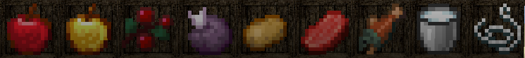
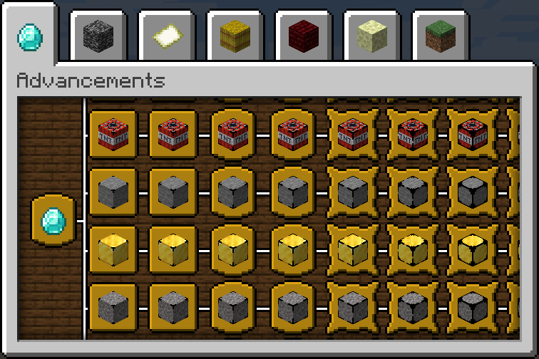
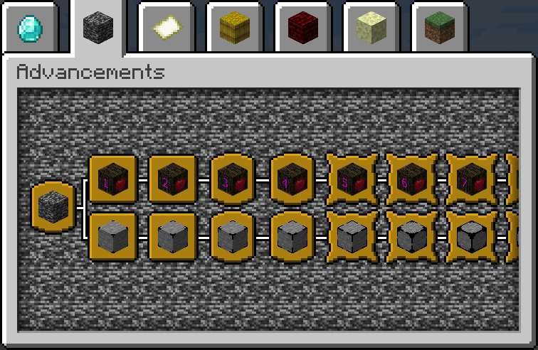
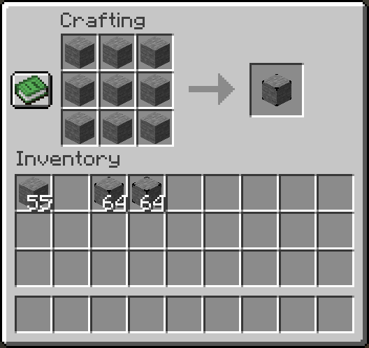
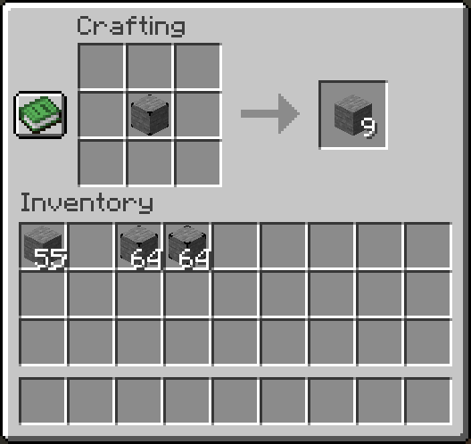
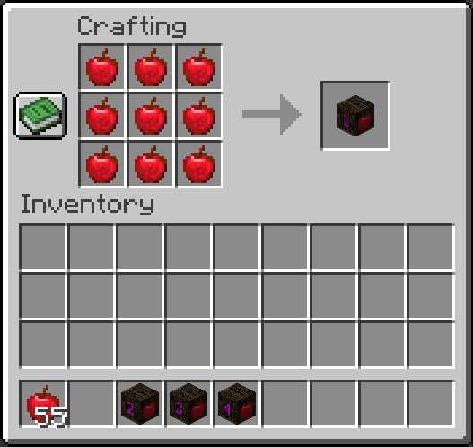
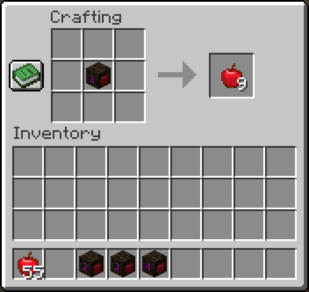

# CB: Compressed Blocks

---

---

## Overview

This mod allows players to compress multiple blocks into a single block or multiple items into an item crate, saving
space in the world.  
The compressed variants can store up to 9 blocks/items of the same type, and with multiple levels of compression, a
single compressed variant can hold as many as **3,486,784,101** blocks or items.  
This allows players to store vast quantities of blocks/items in a single block.  
The compressed block can be decompressed to retrieve the original blocks, making it a versatile tool for building and
storage purposes.  
Currently, the mod offers **`264`** different types of compressed blocks and **`179`** types of crates.

- **Minecraft Versions:** `1.14.4` `1.15.2`, `1.16.5`, `1.17.1`, `1.18.2`, `1.19.2`, `1.19.4`, `1.20.2`, `1.20.4`
- **Mod Loader:** _Fabric_, _Forge_, _Neoforge_
- **Author:** [Sashiro](https://github.com/sa-shiro)

---

## Installation

1. Download the mod from [CurseForge](https://curseforge.com/minecraft/mc-mods/cb-compressed-blocks)
   or [Modrinth](https://modrinth.com/mod/cb-compressed-blocks).
2. Install Minecraft Forge or Fabric Loader + Fabric API.
3. Place the downloaded mod file into the mods' folder.
4. Launch Minecraft and enjoy!

## Features

- **Block Compression:** Compress multiple blocks into one, saving space in your world.
- **Item Compression:** Compress multiple items into one Crate, saving space in your inventory.
- **Expanded Storage:** Store vast quantities of blocks and items in a single compressed block or crate.
- **Versatile Usage:** Utilize compressed blocks for various building and storage purposes.
- **Easy Crafting:** Craft compressed blocks or crates using a 3x3 crafting grid.
- **Decompression:** Decompress compressed blocks and crates back into their original form.

  
Image Showcase

 

 

 

### List of Blocks

  
Full Compressed Blocks List

    - DIRT
    - GRAVEL
    - COBBLESTONE
    - STONE
    - GRANITE
    - DIORITE
    - ANDESITE
    - CRIMSON_NYLIUM
    - WARPED_NYLIUM
    - CLAY
    - SAND
    - RED_SAND
    - SANDSTONE
    - RED_SANDSTONE
    - COAL_ORE
    - IRON_ORE
    - GOLD_ORE
    - NETHER_GOLD_ORE
    - NETHER_QUARTZ_ORE
    - LAPIS_ORE
    - REDSTONE_ORE
    - IRON_BLOCK
    - GOLD_BLOCK
    - LAPIS_BLOCK
    - REDSTONE_BLOCK
    - COAL_BLOCK
    - SLIME_BLOCK
    - HONEY_BLOCK
    - BRICKS
    - STONE_BRICKS
    - NETHERRACK
    - NETHER_BRICKS
    - RED_NETHER_BRICKS
    - NETHER_WART_BLOCK
    - SOUL_SAND
    - SOUL_SOIL
    - END_STONE
    - END_STONE_BRICKS
    - BLACKSTONE
    - DEEPSLATE
    - COBBLED_DEEPSLATE
    - TUFF
    - BASALT
    - OBSIDIAN
    - RAW_IRON_BLOCK
    - RAW_COPPER_BLOCK
    - RAW_GOLD_BLOCK
    - MUD
    - OAK_LOG
    - SPRUCE_LOG
    - BIRCH_LOG
    - JUNGLE_LOG
    - ACACIA_LOG
    - DARK_OAK_LOG
    - MANGROVE_LOG
    - CHERRY_LOG
    - STRIPPED_OAK_LOG
    - STRIPPED_SPRUCE_LOG
    - STRIPPED_BIRCH_LOG
    - STRIPPED_JUNGLE_LOG
    - STRIPPED_ACACIA_LOG
    - STRIPPED_DARK_OAK_LOG
    - STRIPPED_MANGROVE_LOG
    - STRIPPED_CHERRY_LOG
    - OAK_PLANKS
    - SPRUCE_PLANKS
    - BIRCH_PLANKS
    - JUNGLE_PLANKS
    - ACACIA_PLANKS
    - DARK_OAK_PLANKS
    - MANGROVE_PLANKS
    - CHERRY_PLANKS
    - BAMBOO_PLANKS
    - BAMBOO_MOSAIC
    - COPPER_BLOCK
    - CUT_COPPER
    - EXPOSED_COPPER
    - EXPOSED_CUT_COPPER
    - WEATHERED_COPPER
    - WEATHERED_CUT_COPPER
    - OXIDIZED_COPPER
    - OXIDIZED_CUT_COPPER
    - WAXED_COPPER_BLOCK
    - WAXED_CUT_COPPER
    - WAXED_EXPOSED_COPPER
    - WAXED_EXPOSED_CUT_COPPER
    - WAXED_WEATHERED_COPPER
    - WAXED_WEATHERED_CUT_COPPER
    - WAXED_OXIDIZED_COPPER
    - WAXED_OXIDIZED_CUT_COPPER
    - BONE_BLOCK
    - SCULK
    - SMOOTH_SANDSTONE
    - CUT_SANDSTONE
    - CHISELED_SANDSTONE
    - SMOOTH_RED_SANDSTONE
    - CUT_RED_SANDSTONE
    - CHISELED_RED_SANDSTONE
    - DIAMOND_BLOCK
    - NETHERITE_BLOCK
    - CRIMSON_STEM
    - WARPED_STEM
    - TNT
    - EMERALD_BLOCK
    - BAMBOO_BLOCK
    - STRIPPED_BAMBOO_BLOCK
    - STRIPPED_CRIMSON_STEM
    - CRIMSON_PLANKS
    - STRIPPED_WARPED_STEM
    - WARPED_PLANKS
    - MOSSY_COBBLESTONE
    - MOSSY_STONE_BRICKS
    - CRACKED_STONE_BRICKS
    - CHISELED_STONE_BRICKS
    - POLISHED_GRANITE
    - POLISHED_DIORITE
    - POLISHED_ANDESITE
    - CHISELED_DEEPSLATE
    - POLISHED_DEEPSLATE
    - DEEPSLATE_BRICKS
    - CRACKED_DEEPSLATE_BRICKS
    - DEEPSLATE_TILES
    - CRACKED_DEEPSLATE_TILES
    - PACKED_MUD
    - MUD_BRICKS
    - PRISMARINE
    - PRISMARINE_BRICKS
    - DARK_PRISMARINE
    - QUARTZ_BLOCK
    - CHISELED_QUARTZ_BLOCK
    - QUARTZ_BRICKS
    - QUARTZ_PILLAR
    - SMOOTH_QUARTZ_BLOCK
    - AMETHYST_BLOCK
    - WHITE_WOOL
    - LIGHT_GRAY_WOOL
    - GRAY_WOOL
    - BLACK_WOOL
    - BROWN_WOOL
    - RED_WOOL
    - ORANGE_WOOL
    - YELLOW_WOOL
    - LIME_WOOL
    - GREEN_WOOL
    - CYAN_WOOL
    - LIGHT_BLUE_WOOL
    - BLUE_WOOL
    - PURPLE_WOOL
    - MAGENTA_WOOL
    - PINK_WOOL
    - TERRACOTTA
    - WHITE_TERRACOTTA
    - LIGHT_GRAY_TERRACOTTA
    - GRAY_TERRACOTTA
    - BLACK_TERRACOTTA
    - BROWN_TERRACOTTA
    - RED_TERRACOTTA
    - ORANGE_TERRACOTTA
    - YELLOW_TERRACOTTA
    - LIME_TERRACOTTA
    - GREEN_TERRACOTTA
    - CYAN_TERRACOTTA
    - LIGHT_BLUE_TERRACOTTA
    - BLUE_TERRACOTTA
    - PURPLE_TERRACOTTA
    - MAGENTA_TERRACOTTA
    - PINK_TERRACOTTA
    - WHITE_GLAZED_TERRACOTTA
    - LIGHT_GRAY_GLAZED_TERRACOTTA
    - GRAY_GLAZED_TERRACOTTA
    - BLACK_GLAZED_TERRACOTTA
    - BROWN_GLAZED_TERRACOTTA
    - RED_GLAZED_TERRACOTTA
    - ORANGE_GLAZED_TERRACOTTA
    - YELLOW_GLAZED_TERRACOTTA
    - LIME_GLAZED_TERRACOTTA
    - GREEN_GLAZED_TERRACOTTA
    - CYAN_GLAZED_TERRACOTTA
    - LIGHT_BLUE_GLAZED_TERRACOTTA
    - BLUE_GLAZED_TERRACOTTA
    - PURPLE_GLAZED_TERRACOTTA
    - MAGENTA_GLAZED_TERRACOTTA
    - PINK_GLAZED_TERRACOTTA
    - WHITE_CONCRETE_POWDER
    - LIGHT_GRAY_CONCRETE_POWDER
    - GRAY_CONCRETE_POWDER
    - BLACK_CONCRETE_POWDER
    - BROWN_CONCRETE_POWDER
    - RED_CONCRETE_POWDER
    - ORANGE_CONCRETE_POWDER
    - YELLOW_CONCRETE_POWDER
    - LIME_CONCRETE_POWDER
    - GREEN_CONCRETE_POWDER
    - CYAN_CONCRETE_POWDER
    - LIGHT_BLUE_CONCRETE_POWDER
    - BLUE_CONCRETE_POWDER
    - PURPLE_CONCRETE_POWDER
    - MAGENTA_CONCRETE_POWDER
    - PINK_CONCRETE_POWDER
    - WHITE_CONCRETE
    - LIGHT_GRAY_CONCRETE
    - GRAY_CONCRETE
    - BLACK_CONCRETE
    - BROWN_CONCRETE
    - RED_CONCRETE
    - ORANGE_CONCRETE
    - YELLOW_CONCRETE
    - LIME_CONCRETE
    - GREEN_CONCRETE
    - CYAN_CONCRETE
    - LIGHT_BLUE_CONCRETE
    - BLUE_CONCRETE
    - PURPLE_CONCRETE
    - MAGENTA_CONCRETE
    - PINK_CONCRETE
    - GLASS
    - TINTED_GLASS
    - WHITE_STAINED_GLASS
    - LIGHT_GRAY_STAINED_GLASS
    - GRAY_STAINED_GLASS
    - BLACK_STAINED_GLASS
    - BROWN_STAINED_GLASS
    - RED_STAINED_GLASS
    - ORANGE_STAINED_GLASS
    - YELLOW_STAINED_GLASS
    - LIME_STAINED_GLASS
    - GREEN_STAINED_GLASS
    - CYAN_STAINED_GLASS
    - LIGHT_BLUE_STAINED_GLASS
    - BLUE_STAINED_GLASS
    - PURPLE_STAINED_GLASS
    - MAGENTA_STAINED_GLASS
    - PINK_STAINED_GLASS
    - ICE
    - PACKED_ICE
    - BLUE_ICE
    - SNOW_BLOCK
    - MOSS_BLOCK
    - CALCITE
    - DRIPSTONE_BLOCK
    - MAGMA_BLOCK
    - GLOWSTONE
    - DRIED_KELP_BLOCK
    - BROWN_MUSHROOM_BLOCK
    - RED_MUSHROOM_BLOCK
    - SHROOMLIGHT
    - MELON
    - PUMPKIN
    - HAY_BLOCK
    - OCHRE_FROGLIGHT
    - VERDANT_FROGLIGHT
    - PEARLESCENT_FROGLIGHT
    - SEA_LANTERN
    - COPPER_ORE
    - EMERALD_ORE
    - DIAMOND_ORE
    - DEEPSLATE_COPPER_ORE
    - DEEPSLATE_IRON_ORE
    - DEEPSLATE_GOLD_ORE
    - DEEPSLATE_REDSTONE_ORE
    - DEEPSLATE_EMERALD_ORE
    - DEEPSLATE_LAPIS_ORE
    - DEEPSLATE_DIAMOND_ORE
    - DEEPSLATE_COAL_ORE

 

  
Full Crate Blocks List

    - APPLE
    - GOLDEN_APPLE
    - SWEET_BERRIES
    - GLOW_BERRIES
    - CHORUS_FRUIT
    - CARROT
    - GOLDEN_CARROT
    - POTATO
    - BAKED_POTATO
    - POISONOUS_POTATO
    - BEETROOT
    - BEEF
    - COOKED_BEEF
    - PORKCHOP
    - COOKED_PORKCHOP
    - MUTTON
    - COOKED_MUTTON
    - CHICKEN
    - COOKED_CHICKEN
    - RABBIT
    - COOKED_RABBIT
    - COD
    - COOKED_COD
    - SALMON
    - COOKED_SALMON
    - TROPICAL_FISH
    - PUFFERFISH
    - BREAD
    - COOKIE
    - ROTTEN_FLESH
    - SPIDER_EYE
    - MILK_BUCKET
    - HONEY_BOTTLE
    - CHARCOAL
    - QUARTZ
    - AMETHYST_SHARD
    - STICK
    - FLINT
    - BONE
    - STRING
    - FEATHER
    - SNOWBALL
    - EGG
    - LEATHER
    - RABBIT_HIDE
    - HONEYCOMB
    - INK_SAC
    - GLOW_INK_SAC
    - SCUTE
    - CLAY_BALL
    - NAUTILUS_SHELL
    - FIRE_CHARGE
    - BLAZE_ROD
    - NETHER_STAR
    - ENDER_PEARL
    - ENDER_EYE
    - SHULKER_SHELL
    - WHITE_DYE
    - LIGHT_GRAY_DYE
    - GRAY_DYE
    - BLACK_DYE
    - BROWN_DYE
    - RED_DYE
    - ORANGE_DYE
    - YELLOW_DYE
    - LIME_DYE
    - GREEN_DYE
    - CYAN_DYE
    - LIGHT_BLUE_DYE
    - BLUE_DYE
    - PURPLE_DYE
    - MAGENTA_DYE
    - PINK_DYE
    - PAPER
    - BOOK
    - FIREWORK_STAR
    - GLASS_BOTTLE
    - GLOWSTONE_DUST
    - GUNPOWDER
    - DRAGON_BREATH
    - FERMENTED_SPIDER_EYE
    - BLAZE_POWDER
    - SUGAR
    - RABBIT_FOOT
    - GLISTERING_MELON_SLICE
    - MAGMA_CREAM
    - GHAST_TEAR
    - PHANTOM_MEMBRANE
    - EXPERIENCE_BOTTLE
    - TOTEM_OF_UNDYING
    - END_CRYSTAL
    - ARROW
    - SPECTRAL_ARROW
    - NAME_TAG
    - LEAD
    - EMPTY_MAP
    - SADDLE
    - RAIL
    - POWERED_RAIL
    - DETECTOR_RAIL
    - ACTIVATOR_RAIL
    - MINECART
    - REDSTONE_TORCH
    - REPEATER
    - COMPARATOR
    - LIGHTNING_ROD
    - TORCH
    - SOUL_TORCH
    - LANTERN
    - SOUL_LANTERN
    - CHAIN
    - END_ROD
    - ANVIL
    - CAMPFIRE
    - SOUL_CAMPFIRE
    - ITEM_FRAME
    - GLOW_ITEM_FRAME
    - PAINTING
    - POINTED_DRIPSTONE
    - OAK_SAPLING
    - SPRUCE_SAPLING
    - BIRCH_SAPLING
    - JUNGLE_SAPLING
    - ACACIA_SAPLING
    - DARK_OAK_SAPLING
    - CHERRY_SAPLING
    - MANGROVE_PROPAGULE
    - BROWN_MUSHROOM
    - RED_MUSHROOM
    - CRIMSON_FUNGUS
    - WARPED_FUNGUS
    - DANDELION
    - POPPY
    - BLUE_ORCHID
    - ALLIUM
    - AZURE_BLUET
    - RED_TULIP
    - ORANGE_TULIP
    - WHITE_TULIP
    - PINK_TULIP
    - OXEYE_DAISY
    - CORNFLOWER
    - LILY_OF_THE_VALLEY
    - SUGAR_CANE
    - WITHER_ROSE
    - SUNFLOWER
    - LILAC
    - ROSE_BUSH
    - PEONY
    - TURTLE_EGG
    - WHEAT_SEEDS
    - COCOA_BEANS
    - PUMPKIN_SEEDS
    - MELON_SEEDS
    - BEETROOT_SEEDS
    - SEAGRASS
    - KELP
    - COBWEB
    - WHITE_CARPET
    - LIGHT_GRAY_CARPET
    - GRAY_CARPET
    - BLACK_CARPET
    - BROWN_CARPET
    - RED_CARPET
    - ORANGE_CARPET
    - YELLOW_CARPET
    - LIME_CARPET
    - GREEN_CARPET
    - CYAN_CARPET
    - LIGHT_BLUE_CARPET
    - BLUE_CARPET
    - PURPLE_CARPET
    - MAGENTA_CARPET
    - PINK_CARPET
    - VINE
    - TWISTING_VINES
    - WEEPING_VINES
    - GLOW_LICHEN
    - SCULK_VEIN

## Usage

Crafting compressed blocks:

1. Open the vanilla crafting table.
2. Place 9 of the desired blocks in a 3x3 crafting grid to create a compressed block.
3. Craft the compressed block.

To decompress a block:

1. Place the compressed block either in the player's crafting inventory or a crafting table.
2. The compressed block will decompress back into its original nine blocks.

## Contributing

If you would like to contribute to the development of this mod, please fork the repository, make your changes, and
submit a pull request.

## Support

For any questions, issues, or suggestions, feel free to join our Discord server.

## License

This mod is licensed under the MIT. See the [LICENSE](LICENSE.md) file for more details.